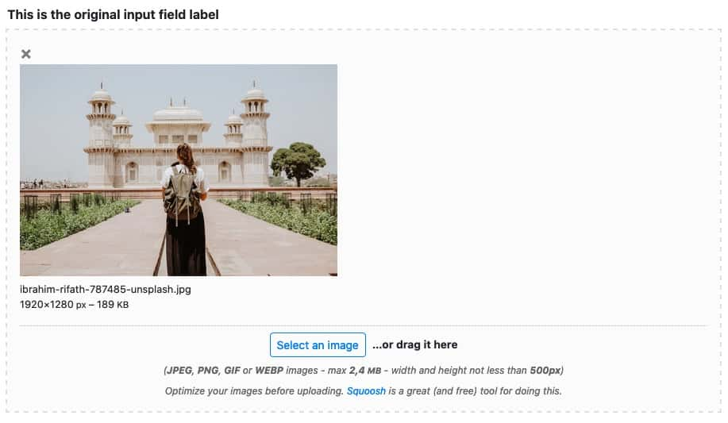
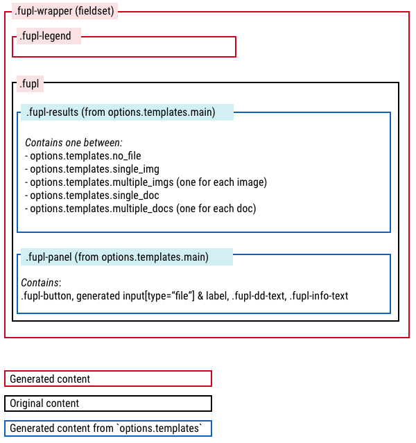

# FileUploader

**js-file-uploader: HTML5 + Javascript asyncronous file upload.**  
*v. 3 - Massimo Cassandro - (c) 2017/2021*

[demo](https://massimo-cassandro.github.io/js-file-uploader/demo/)

JS-File-Uploader is a small javascript utility (less than 8kb minified and gzipped) that simplifies uploading files to HTML pages.

Uploads are performed asynchronously via an Ajax call to a server-side script that must register the file and return a JSON string.

Although the default settings are based on Bootstrap 4, FileUploader is entirely and easily configurable from scratch and can be adapted to any layout.

The [demo](https://massimo-cassandro.github.io/js-file-uploader/demo/) folder contains many examples of FileUploader using.

Works with all modern browser (tested thanks to [Browserstack Open Source program](https://www.browserstack.com/open-source)).

## Features

* Provide the user with a better interface and feedback than the standard input-file element: it can instantly show a preview of the uploaded file (if it is image) and show some information like name, size etc.
* Provide an easy way to add constraints to file format, aspect ratio, size and weight
* Perform multiple uploads in file-by-file way, thus avoiding any server-side limitations on upload size

 

* Although the default settings are based on Bootstrap 4, JS-File-Uploader is entirely and easily configurable from scratch and can be adapted to any layout.
* All string messages can be customized using the desired language (the default language is Italian and an English translation is included in the distribution).

The [demo](https://massimo-cassandro.github.io/js-file-uploader/demo/) folder contains many examples of FileUploader using.


## Browser compatibility

JS-File-Uploader needs a modern browser and is not compatible with Internet Explorer.

Anyway, providing a fallback `input[type="file"]` field (recommended), JS-File-Uploader silently degrade to the input element. You just have to provide that the server-side processing includes this possibility.

JS-File-Uploader is tested with many browsers and mobile devices (thanks to [Browserstack Open Source program](https://www.browserstack.com/open-source)).


## Installation and startup

JS-File-Uploader can be installed using [npm](https://www.npmjs.com/package/@massimo-cassandro/js-file-uploader):

```bash
npm i @massimo-cassandro/js-file-uploader
```

You can add JS-File-Uploader importing the bundled ES module version contained in the `dist` folder, or the original source from `src`:

```js
// bundled ESM version
import FileUploader from `@massimo-cassandro/js-fileuploader/dist/FileUploader.esm.min.js`;
```

```js
// source version
import FileUploader from `@massimo-cassandro/js-fileuploader/src/file_uploader`;
```

All the demo pages load JS-File-Uploader from `src`.


You can also use the UMD version directly in your browser:

```html
<script src="path/to/FileUploader.umd.min.js"></script>

<!-- optional language -->
<script src="path/to/en.umd.min.js"></script>
```

`FileUploader.umd.min.js` exposes the `FileUploader` global variable, and `en.umd.min.js` exposes `fupl_strings_en`. Take a look to the [UMD demo](https://massimo-cassandro.github.io/js-file-uploader/demo/umd-version-demo.html) for a detailed example.

### CSS

You also need to add some css to make JS-File-Uploader work.

The best and easiest way is to use the SCSS files contained in the `scss` directory. However there is a compiled ` .css` file into `dist`.

You just need to import the `fileUploader.scss` file into your project. To customize colors and other properties, change the values of the variables listed in `_fupl-default-variables.scss` before importing:

```scss
$fupl-outline-color: #ddd;
$fupl-outline-color-dragover: #e4d70d;
$fupl-background-color: #fbfbfb;
// ...

import 'scss/fileUploader.scss';
```

### Starting JS-File-Uploader

To start FileUploader you must first add it to your pages as explained before, and then instantiate it:

```js
FileUploader({
    selector    : [string] // selector of fileuploader elements (default `.file-uploader2`)
    options     : [object] // custom options
    css         : [string] // css url
    local_strs  : [object] // localized strings
})
```

where:

* `selector` is a string to use as a selector for FileUploader elements. It can be a `class`, an `id` or any other valid selector. FileUploader will be automatically activated on these items. The default is `.file-uploader2`
* `options` is an object of various parameters to modify the behaviors of FileUploader. This object contains the only required configuration option: `uploader_url`, the server-side scripting URL needed to save remote files. Read the [FileUploader Options] (options) chapter for details on all parameters.
* `css` if the optional url for the css file used by FileUploader. Since it can be joined with your project css file, this parameter can be `null`.
* `local_strs` is an object that contains localized strings for FileUploader interface. Read the **Languages** paragraph in this page for more info.

Therefore, a really minimal FileUploader setup could be:

```html
<div class="file-uploader2"></div>

<script type="module">
  import FileUploader from '@massimo-cassandro/js-fileuploader/dist/FileUploader.esm.min.js';
  FileUploader({
    options: {
      uploader_url: '/path/to/server-side-script'
    }
  })
</script>
```

However, it is very likely that you will need to configure additional parameters, add a fallback for older browsers or improve accessibility. For a more complete explanation of FileUploader configuration, read the [Setup](setup) chapter.

### Languages

JS-File-Uploader main language is Italian. An english translation is provided (but you may need to make some adjustments...).

To add other languages, you need to translate ʻen.js` or ʻit.js` (in the `src/i18n` directory) and use the new file when starting JS-File-Uploader:

```js
import FileUploader from `@massimo-cassandro/js-fileuploader/src/file_uploader`;

// exposes the var `my_lang`
import fupl_strings_en from 'path/to/new_language.js';

FileUploader({
  options: {
    // ... options ...
  },
  local_strs: my_lang
});
```

You can also send a pull request for you translation file, to have it included in future JS-File-Uploader distributions.


## Server-Side scripting


FileUploader requires a server-side script to manage file uploading.

The goal of FileUploader is to allow asynchronous uploading of files, saving them definitively on server only after the form containing the input file has been submitted. The script must place the file in a temporary directory (eg `tmp`), giving it a temporary name.

After form submit, uploaded files have to be be moved to their final destination: this way any unsubmitted form will not leave any *orphaned* file, since the files left in the `tmp` directory should be periodically deleted.


When a file is uploaded, FileUploader receives from the server side script, the information necessary to complete the registration, inserts it in a series of hidden inputs, and returns it to the server when the form is submitted.

For each file selected, FileUploader send to server-side script a *POST* call with file data. PHP `$_FILES` variable, for example, returns to the script something like this:

```php
Array
(
    [file] => Array
        (
            [name] => myfile.jpg
            [type] => image/jpeg
            [tmp_name] => /tmp/php/phpGu39M5
            [error] => 0
            [size] => 8772
        )
)
```
The script must process the request (save the file in `tmp` directory), and return a json formatted as follows:


```json
{
  "tmp_file": "path/to/tmp/file",
  "error": null
}
```

where:

* `tmp_file` is the path to the temporary file registered on the server
* `error` is` null` on success, or a string of the error message produced by the server.

Then FileUploader will build a hidden field for each of these parameters:

* `tmp_file`: name of temporary file (as returned by the json response)
* `file_name`: name of the original file (web normalized)
* `size`: file size (bytes)
* `type`: file mimetype

In case of images, the `width` and` height` values ​​of the image itself will also be present.

All values will be used to create some *hidden* fields whose `name` attribute will consist of:

* the value of the `varname` parameter
* an unique id corresponding to the file
* the variable name

Example (with `varname='custom_file'` and unique id equal to `__unique_id__`):

```html
<input type="hidden" name="custom_file[__unique_id__][tmp_file]" value="...">
<input type="hidden" name="custom_file[__unique_id__][file_name]" value="...">
[...]
```

A demo including a server side sample script can be found in the repository at `demo/php_sample`


## Detailed setup

### Starting uploader

The minimal needed markup is 

```html
<div data-file-uploader></div>
```

Anyway, to ensure accessibility and graceful degrations is strongly recommended to add a fallback input field:

```html
<div data-file-uploader>
    <input type="file" name="fallback-field">
</div>
```

When FileUploader is started, the internal field is replaced with a generated one.
But if it fails, by adding the inner field you can ensure the basic functionality of your form.

### Parameters setting

FileUploader configuration is based on parameters defined in `src/_default_options.js`

The parameters can be overridden according to this cascading sequence:

* Values of `_default_options.js` file are the default ones
* Parameters assigned in the `FileUploader()` obj argument override the default ones, and are valid for all the FileUploader elements involved
* Parameters assigned to each FileUploader instance, using `data-*` attributes, prevail and override the previous ones: in this way it is possible to have different behaviors also on the same page.

Finally, if an `input [type="file"]` field is present inside the FileUploader element, any `accept`,` required`, `multiple` or` disabled` attributes are taken into account in the configuration .

For example, you can set a FileUploader as *required* either by setting the `data-required="true"` attribute of the FileUploader element, or by using the` required` attribute of the file field.

Data attributes can be set as single items (e.g. `data-disabled="true"`) or as a json object to be assigned to the `data-file-uploader` attribute:

```html
<div data-file-uploader='{"disabled": true, "multiple": true}'>
```

>NB: if the `required`,` multiple` or `disabled` parameters are set to `true` in the FileUploader instance, it is not possible to set them to `false` via the input field attributes.

See `_default_options.js` for a complete list of all parameters.


### Deleting a pre-registered file

When a pre-registered file is removed from FileUploader, a hidden field is generated.

It contains the id of the removed file as `value` and the `delete_varname` parameter as `name`.

You must provide the necessary server side script to definitively remove the file from the server.

```html
<input type="hidden" name="delete_file_var[]" value="123">
```

### Customization

FileUploader configuration parameter allow you to radically change the generated layout.

To perform a complete customization of the layout, you can modify both the css and much of the markup.
furthermore, some callbacks can be set to perform additional operations.

When a FileUploader  is generated, the `fupl` class is added to the original element (black bordered in the following diagram), and some additional markup is then generated inside and outside it. The internal one (blue bordered) is completely configurable by modifying the templates parameters.



> Take care to preserve elements with `fupl-*` classes, that are requested by FileUploader


#### Callbacks

If specific behaviors are required, you can define some callback functions that will be invoked when certain events occur:

* `init_callback` (default null): called after the initialization of each FileUploader element. The argument of this function is an object containing all the options of the instance

* `upload_start_callback` (default null): function called whenever a file is sent to the server. The function is invoked by passing an object containing:
    * `item`: object. It contains:
        - `id`: unique ID of the item
        - `file`: current * filelist * object
        - `width` and `height`: null or dimensions in pixels of the image
        - `tmp_file`: temporary file name assigned by the server side script
    * `img_preview`: image thumbnail as a Base64 string
    (null if it is of other types)
    * `options`: options of current FileUploader instance

* `upload_complete_callback` (default null): function called whenever a file is loaded. The function is invoked by passing an object containing:
     * `item`: object. It contains:
        - `id`: unique ID of the item
        - `file`: current * filelist * object
        - `width` and `height`: null or dimensions in pixels of the image
        - `tmp_file`: temporary file name assigned by the server side script
    * `server_error`: null, if the upload was completed successfully, or string with the returned error message
    * `options`: options of current FileUploader instance

* `alternative_loading_func` (default null): Not a real callback, but an alternative function to display the upload progress. If present, it replaces the standard one.
It is invoked with two parameters:
    - `progress_event`: progress upload event
    - `options`: options of current FileUploader instance


### Fancybox integration

FileUploader can be integrated with [Fancybox (v. 3)](https://www.fancyapps.com/fancybox/3/), simply setting
the `fancybox` option to `true`.

Fancybox application files are not loaded by FileUploader and have to be present in the HTML page before FileUploader loads.

Fancybox is applied only to previously registered images.


## Recipes


### Checking for completed loading

As soon as an item is added to the uploader, an Ajax request is sent to the server for file registration. When the operation is completed, the server returns a json with the data of the recorded file, as indicated in the previous points.

From the moment the request is sent and until the server responds, the user can still submit the form, but in this case all the hidden elements related to the uploading file that will not be will not be present, therefore they will noit be registered

To avoid this problem, you can enable the `disable_submit` option which disables the *Submit * button of form until the server has sent its response.

However, this option is not sufficient to ensure that problems of this type are avoided (in some cases, the user could submit with the Enter key), and it is also possible that other settings re-enable the button regardless of the upload outcome.

The safest solution is therefore to block the submit if there are elements with the `fupl-is-uploading` class, class assigned to each new element added to the uploader and deleted upon completion of loading:

```javascript
let myForm = document.getElementById('myForm');
myForm.addEventListener('submit', () => {
    if(myForm.querySelectorAll('.fupl-is-uploading').length) {
        alert('Loading not completed');
        return false;
    }
});
```

If FileUploader is used in multiple pages, it is possible to set a centralized control on all form elements:

```javascript
document.querySelectorAll('form').forEach( this_form => {
    this_form.addEventListener('submit', () => {
        if(this_form.querySelectorAll('.fupl-is-uploading').length) {
            alert('Wait for the image upload to complete!');
            return false;
        }
    });
});
```

The module `src-utilities/check_uncompleted_uploads.js` is already ready for this purpose. Check the [uncompleted upload demo page](https://massimo-cassandro.github.io/js-file-uploader/demo/uncompleted-upload.html)

However, implementing a server-side control too is certainly a good idea.


### Required fields checking

Since a file can be loaded via *Drag & Drop*, it is not possible to use the native `required` to check for  mandatory files.

However, this check can be performed using the `data` attributes added dynamically to the` .fupl-wrapper` element: `data-required="true"` and `data-has-values="true|false"`.

Therefore, to verify the required content of the `# my-uploader` element, it is very simple:

```javascript
document.getElementById('my-uploader')
    .closest('.fupl-wrapper:not([disabled])[data-required="true"][data-has-values="true"]') !== null
```

Or, to check the entire form:

```javascript
document.querySelectorAll('.fupl-wrapper:not([disabled])[data-required="true"][data-has-values="false"]').length === 0
```

You can also import the ready-to-use `scr-utilities/check_required_uploader.js` script in your project. Take a look at the [required uploader demo page](https://massimo-cassandro.github.io/js-file-uploader/demo/required.html)


## About the demo

The examples in the [demo](https://massimo-cassandro.github.io/js-file-uploader/demo/) folder load FileUploader directly from the ES6 modules in the  <code>src</code> folder, but you can easily use one of the UMD version present in the “dist” folder (see the **UMD version demo**) or the compiled all-in-one ES6 module version.

They also do not use a server-side engine (so the form tag is not present, except in some cases) and therefore the server response is simulated thru a static json file (<code>demo/demo-assets/server-side-demo-response.json</code>). However, there is a simple php example of server-side application (in <code>/demo/php_sample</code> folder) that you can look at.

The demo uses some extra tools that are not needed in your projects: [Prism](https://prismjs.com/) and [js-beautify)](https://beautifier.io/).
For better clarity, they area managed with dedicated files, all contained in <code>demo/demo-assets</code> folder.

For the same reason, both [Bootstrap](https://getbootstrap.com) and [JQuery](https://jquery.com/) are loaded from CDNs when needed.

All the css and the js files really related to FileUploader are located in <code>demo/css</code> and <code>demo/js</code> folders. 

When needed, scss and js files are compiled or merged using [Codekit](https://codekitapp.com/).

### Demo pages structure

Each demo page consists of 5 boxes:

* The first is the real demo, which is an example of a FileUploader implementation
* The **Original Markup** box contains the html code used to activate FileUploader
* The **Javascript** box contains the code that calls the ES6 FileUploader library and instantiates the demo. The code is located in the JS file shown in parentheses  
* The **Generated markup** box contains the html code after Fileuploader parsing
* The last box, **Parsed FileUploader options**, contains the object generated merging (in this order):
    * the default options object (in `src/_default_options.js`)
    * the options set when FileUploader was instantiated (you can see them in the *Javascript* box)
    * the configuration retrieved from data attributes of `data-file-uploader` element. This object is the same you can see in the browser console, and both them are visible only when `debug` option is set to `true`.


## TODO

There is a long list of future implementation and fix I've planned, take a look at <https://github.com/massimo-cassandro/js-file-uploader/issues/4>.


## References (and inspirations)
- <https://css-tricks.com/drag-and-drop-file-uploading/>
- <https://tympanus.net/codrops/2015/09/15/styling-customizing-file-inputs-smart-way/>
- <https://developer.mozilla.org/en-US/docs/Web/Guide/HTML/HTML5/Constraint_validation#Limiting_the_size_of_a_file_before_its_upload>
- <https://www.smashingmagazine.com/2018/01/drag-drop-file-uploader-vanilla-js/>
- <https://codepen.io/therealDaze/pen/ZaoErp>
- <https://github.com/gridstack/gridstack.js>
- <https://developer.mozilla.org/it/docs/Web/API/HTML_Drag_and_Drop_API>
- <https://www.html5rocks.com/en/tutorials/dnd/basics/>
- <https://kryogenix.org/code/browser/custom-drag-image.html>

## Changelog

### V.3.0.0 (Jul 2021)
* naming and directories updates

### V.2.3 (Apr 2021)
* Added built-in alert interface
* Dropped custom alert UI support 


### V. 2.0 (Oct 2020)
* All rewritten as ES6 module
* Dropped check and callback for legacy browsers
* New demo pages

### Version 1.4-1.7 (Jul-Sep 2020) 
* SVG images support
* Mixed SVG + Bitmap images allowed
* ability to add an extra custom help text
* aspect ratio constrain (see specific demo page)
* Bootstrap moved to dev-dependencies in package json

### Version 1.3 (Aug 2019)
* Fancybox integration
* items sorting
* Handling of disabled and required status
* Extra fields

### Version 1.0-1.2 (2017)
* First production releases with basic features
