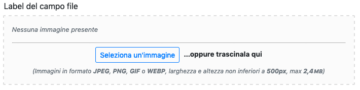
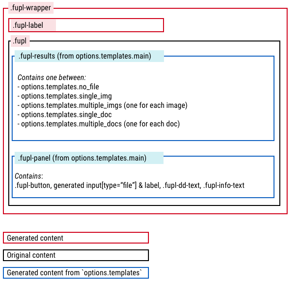

# JS FileUploader

**HTML5 + Javascript asyncronous file upload.**
*v. 1 - Massimo Cassandro - (c) 2017/2019*

Fileuploader automates and simplifies uploading files to HTML pages.

Uploads are performed asynchronously via an Ajax call to a server-side script that must register the file and return a JSON string.

Although the default settings are based on Bootstrap 4, FileUploader is entirely and easily configurable from scratch and can be adapted to any layout.

Similarly, all the string messages can be customized using the desired language. Look at the [\_set\_options.js](js/_set_options.js) file for a complete list of all available parameters.

The [demo](https://massimo-cassandro.github.io/js-file-uploader/demo/) folder contains many examples of FileUploader using.


## Browser compatibility
FileUploader needs a modern browser and is not compatible with Internet Explorer.
Also requires Edge 16 or higher.

If the browser is not compatible, an *alert* window is showed and FileUploader stops. The message shown is the one indicated in the `alert_messages.unsuitable_browser`parameter

However, it is possible to silently degrade FileUploader and use the browser standard `input[type="file"]` tag.

To perform this option, you need to:

* set `silent_degradation` option to *true* (default is *false*);
* provide a fallback input tag inside the FileUploader element;
* set a fallback init function if necessary (`unsuitable_browser_callback` parameter). This can be useuful to activate specific fallback  behaviours;
* add the `enctype` attribute to your form (FileUploader doesn't need it)
* provide the necessary server side scripting. Very likely, the script to be used in this situation differs from the one used in the Ajax procedure.

Take a look at the [silent degradation demo](https://massimo-cassandro.github.io/js-file-uploader/demo/silent_degradation_sample.html).

## Codekit
All distribution files are built using [Codekit](https://codekitapp.com/), but you can easily switch to other tools, if you need.

## Localization
Actually, all localization strings are part of `default_options` object (in `_set_options.js`). The default language is italian.

To change language, you can provide the desidered strings in the `init` function (as in demo files) or you can edit the `default_options` objects and rebuild dist files.

Furthermore, you have to set the `locales` parameter to the desidered value to correctly represent numeric values. 


## Installation

FileUploader can be installed thru npm:

```
npm i --save js-file-uploader
```

## Using FileUploader

Once `file_uploader-min.js` has been added to your HTML page, FileUploader must be started setting up some parameters using the `init` function.

Minimal setup:

```html
<script src="file_uploader-min.js"></script>
```

```javascript
FileUploader.init({
  uploader_url   : 'path/to/server/script'
});
```
The argument of`init is an object that sets some parameters. A complete list of them is described in [\_set\_options.js](js/_set_options.js) file.

Once initialized, FileUploader is applied to all element with the `data-file-uploader` attribute:

--


--

The `demo` folder contains several FileUploader examples.

> NB: The default selector is `data-file-uploader`, but, if necessary, the` file-uploader` part can be replaced with any string (with *dataset* compatible syntax, see <https://developer.mozilla.org/en-US/demo/Web/API/HTMLElement/dataset>) using the `fupl_selector` option:

```javascript
FileUploader.init({
  uploader_url   : 'path/to/server/script',
  fupl_selector  : 'my-uploader'
});
```


### Markup
To activate FileUploader, this minimum markup is required:

```html
<div data-file-uploader></div>
```

FileUploader will be activated with the global parameters defined in [\_set\_options.js](js/_set_options.js) and in `FileUploader.init()` argument.

However, it is possible to customize each individual instance using data attributes matching the same global parameters.

For example, if you want to use a specific server-side script (different from the globally defined one) for a specific instance, you can indicate it this way:

```html
<div data-file-uploader data-uploader_url="path/to/alternate/server/script"></div>
```
You can also define parameters using a json string to be assigned directly to `data-file-uploader` attribute:

```html
<div data-file-uploader='{"uploader_url": "path/to/alternate/server/script"}'></div>
```

> Note that some parameters, such as `css`, make sense only if defined globally.

Finally, it is possible to insert a `input type="file"]` field inside the `data-file-uploader` element, as a fallback for older browsers (see the **Browser compatibility** paragraph). 

If FileUploader starts correctly, the input field is removed, otherwise it can be used as a standard HTML field.

To simplify configuration, all attributes of input file (multiple, required, accept, disabled) are passed to FileUploader, so you haven't to set it twice.

For example, to activate the `multiple` option, you can define it using the `data-multiple="true"` attribute in the FileUploader element, or adding the `multiple` attribute to the `input type="file"]` element (if present).

In case of conflict, generally, the last element prevails (see **Parameters setting** paragraph).

```html
<div data-file-uploader>
    <input type="file" name="fallback">
</div>
```


### CSS

The default css file is based on Bootstrap 4 (not included), but you can change it, even changing, if necessary, the generated markup, through the `templates` parameter (see [\_set\_options.js](js/_set_options js)).

It is also possible to include the FileUploader css in your project style sheets; in this case it is sufficient to set the `css` parameter to `null` (the default value).

> **All changes must take care to preserve the class names prefixed with `fupl-`.**


### Parameters setting

FileUploader configuration is based on parameters defined in [\_set\_options.js](js/_set_options.js).

The parameters can be overridden according to this cascading sequence:

* Values of `_set_options.js` file are the default ones
* Parameters assigned in `FileUploader.init()` override the default ones, and are valid for all the FileUploader elements involved
* Parameters assigned to each FileUploader instance prevail and override the previous ones: in this way it is possible to have different behaviors also on the same page.

Finally, if an `input [type="file"]` field is present inside the FileUploader element, any `accept`,` required`, `multiple` or` disabled` attributes are taken into account in the configuration .

For example, you can set a FileUploader as *required* either by setting the `data-required="true"` attribute of the FileUploader element, or by using the` required` attribute of the file field.

>NB: if the `required`,` multiple` or `disabled` parameters are set to `true` in the FileUploader instance, it is not possible to set them to `false` via the input field attributes.


## Server-side script

FileUploader requires a server-side script to manage file uploading.

The goal of FileUploader is to allow asynchronous uploading of files, saving them definitively on server only after the form containing the input file has been submitted. The script must place the file in a temporary directory (eg `tmp`), giving it a temporary name.

After form submit, uploaded files have to be be moved to their final destination: this way any unsubmitted form will not leave any *orphaned* file, since the files left in the `tmp` directory should be periodically deleted.


When a file is uploaded, FileUploader receives from the server side script, the information necessary to complete the registration, inserts it in a series of hidden inputs, and returns it to the server when the form is submitted.

For each file selected, FileUploader send to server-side script a *POST* call with file data. PHP `$_FILES` variable, for example, returns to the script something like this:

```php
Array
(
    [file] => Array
        (
            [name] => myfile.jpg
            [type] => image/jpeg
            [tmp_name] => /tmp/php/phpGu39M5
            [error] => 0
            [size] => 8772
        )
)
```
The script must process the request (save the file in `tmp` directory), and return a json formatted as follows:


```json
{
  "tmp_file": "path/to/tmp/file",
  "error": null
}
```

where:

* `tmp_file` is the path to the temporary file registered on the server
* `error` is` null` on success, or a string of the error message produced by the server.

Then FileUploader will build a hidden field for each of these parameters:

* `tmp_file`: name of temporary file (as returned by the json response)
* `file_name`: name of the original file (web normalized)
* `size`: file size (bytes)
* `type`: file mimetype

In case of images, the `width` and` height` values ​​of the image itself will also be present.

All values will be used to create some *hidden* fields whose `name` attribute will consist of:

* the value of the `varname` parameter
* an unique id corresponding to the file
* the variable name

Example (with `varname='custom_file'` and unique id equal to `__unique_id__`):

```html
<input type="hidden" name="custom_file[__unique_id__][tmp_file]" value="...">
<input type="hidden" name="custom_file[__unique_id__][file_name]" value="...">
[...]
```


## Customization

FileUploader configuration parameter allow you to radical change the generated layout.

To perform a complete customization of the layout, you can modify both the css and much of the markup (mostly the items inside the `templates` parameter).
furthermore, some callbacks can be set to perform additional operations.

When a FileUploader  is generated, the `fupl` class is added to the original element (black bordered in the following diagram), and some additional markup is then generated inside and outside it. The internal one (blue bordered) is completely configurable by modifying the `templates` parameters.



> Take care to preserve elements with `fupl-*` classes, that are requested by FileUploader


### Callback

If specific behaviors are required, you can define some callback functions that will be invoked when certain events occur:

* `init_callback` (default null): called after the initialization of each FileUploader element. The argument of this function is an object containing all the options of the instance

* `unsuitable_browser_callback` (default null): function called if an unsuitable browser is detected

* `upload_start_callback` (null default): function called whenever a file is sent to the server. The function is invoked by passing an object containing:
    * `item`: object. It contains:
        - `id`: unique ID of the item
        - `file`: current * filelist * object
        - `width` and `height`: null or dimensions in pixels of the image
        - `tmp_file`: temporary file name assigned by the server side script
    * `img_preview`: image thumbnail as a Base64 string
    (null if it is of other types)
    * `options`: FileUploader options of current istance 

* `upload_complete_callback` (default null): function called whenever a file is loaded. The function is invoked by passing an object containing:
     * `item`: object. It contains:
        - `id`: unique ID of the item
        - `file`: current * filelist * object
        - `width` and `height`: null or dimensions in pixels of the image
        - `tmp_file`: temporary file name assigned by the server side script
    * `server_error`: null, if the upload was completed successfully, or string with the returned error message
    * `options`: FileUploader options of current istance 

* `alternate_loading_func` (default null): Not a real callback, but an alternative function to display the upload progress. If present, it replaces the standard one.
It is invoked with two parameters:
    - `progress_event`: progress upload event
    - `options`: FileUploader options of current istance 


## Fancybox integration

FileUploader can be integrated with [Fancybox (v. 3)](https://www.fancyapps.com/fancybox/3/), simply setting
the `fancybox` option to `true`.

Fancybox application files are not loaded by FileUploader and have to be present in the HTML page before FileUploader loads.

Fancybox is applied only to previously registered images.


## Recipes

### Controllo caricamento completato

As soon as an item is added to the uploader, an Ajax request is sent to the server for file registration. When the operation is completed, the server returns a json with the data of the recorded file, as indicated in the previous points.

From the moment the request is sent and until the server responds, the user can still submit the form, but in this case all the hidden elements related to the uploading file that will not be will not be present, therefore they will noit be registered

To avoid this problem, you can enable the `disable_submit` option which disables the *Submit * button of form until the server has sent its response.

However, this option is not sufficient to ensure that problems of this type are avoided (in some cases, the user could submit with the Enter key), and it is also possible that other settings re-enable the button regardless of the upload outcome.

The safest solution is therefore to block the submit if there are elements with the `fupl-is-uploading` class, class assigned to each new element added to the uploader and deleted upon completion of loading:

```javascript
let myForm = document.getElementById('myForm');
myForm.addEventListener('submit', () => {
    if(myForm.querySelectorAll('.fupl-is-uploading').length) {
        alert('Loading not completed');
        return false;
    }
});
```

If FileUploader is used in multiple pages, it is possible to set a centralized control on all form elements:

```javascript
document.querySelectorAll('form').forEach( this_form => {
    this_form.addEventListener('submit', () => {
        if(this_form.querySelectorAll('.fupl-is-uploading').length) {
            alert('Wait for the image upload to complete!');
            return false;
        }
    });
});
```

Using jQuery:

```javascript
$('form').each(function() {
    $(this).submit(function() {
        if($('.fupl-is-uploading', this).length) {
            alert('Devi attendere che il caricamento delle immagini sia completato');
            return false;
        }
    });
});
```

However, implementing a server-side control too is certainly a good idea.

### Unsuitable browsers blocking

To prevent the submission of forms in non-compatible browsers (jQuery):

```js

FileUploader.init({
  
  [...]

  /*
    adds the class 'unsuitable_browser'
    and removes the submit button, but does not prevent form submit
  */
  unsuitable_browser_callback: function () {
    $('[data-file-uploader]')
      .closest('form')
        .addClass('unsuitable_browser')
        .find(':submit').each( function() {
          $(this).replaceWith( '<div class="alert alert-danger my-4">You are using an incompatible browser</div>' );
        });
  }

});

// stop form submit
$('form').each(function() {
    
  $(this).submit(function() {

    if($(this).hasClass('unsuitable_browser')) {
      alert("You are using an incompatible browser. Cannot load images");
      return false;
    }
  });
});
```

### `required` fields checking

Since a file can be loaded via *Drag & Drop*, it is not possible to use the native `required` to check for  mandatory files.

However, this check can be performed using the `data` attributes added dynamically to the` .fupl-wrapper` element: `data-required="true"` and `data-has-values="true|false" `.

Therefore, to verify the required content of the `# my-uploader` element, it is very simple:


```javascript
document.getElementById('my-uploader')
    .closest('.fupl-wrapper:not([disabled])[data-required="true"][data-has-values="true"]') !== null
```

Or, to check the entire form:

```javascript
document.querySelectorAll('.fupl-wrapper:not([disabled])[data-required="true"][data-has-values="false"]').length === 0
```


## References (and inspirations)
- <https://css-tricks.com/drag-and-drop-file-uploading/>
- <https://tympanus.net/codrops/2015/09/15/styling-customizing-file-inputs-smart-way/>
- <https://developer.mozilla.org/en-US/docs/Web/Guide/HTML/HTML5/Constraint_validation#Limiting_the_size_of_a_file_before_its_upload>
- <https://www.smashingmagazine.com/2018/01/drag-drop-file-uploader-vanilla-js/>
- <https://codepen.io/therealDaze/pen/ZaoErp>
- <https://github.com/gridstack/gridstack.js>
- <https://developer.mozilla.org/it/docs/Web/API/HTML_Drag_and_Drop_API>
- <https://www.html5rocks.com/en/tutorials/dnd/basics/>
- <https://kryogenix.org/code/browser/custom-drag-image.html>
